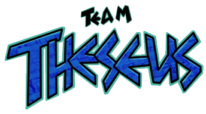
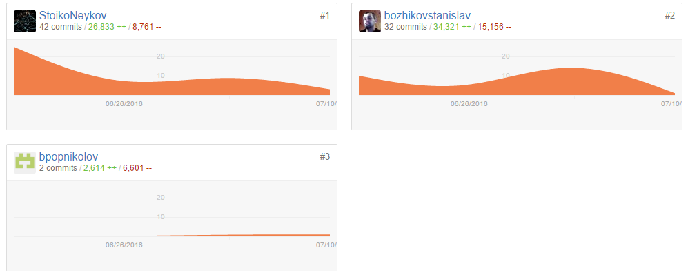
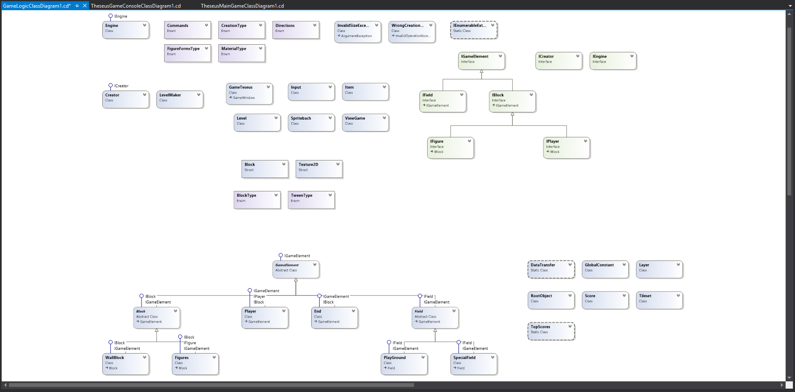
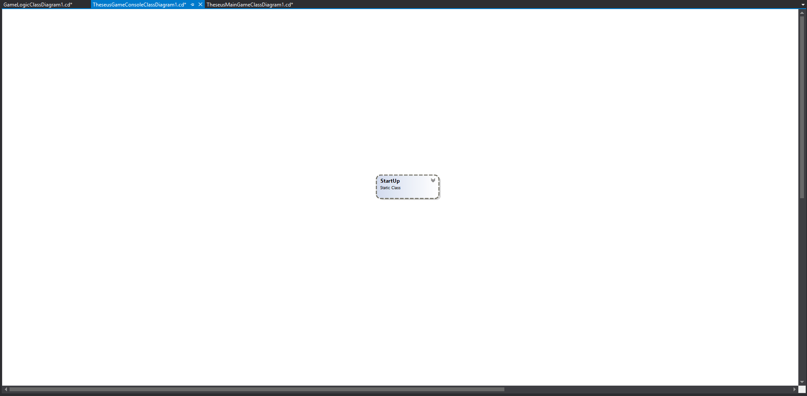
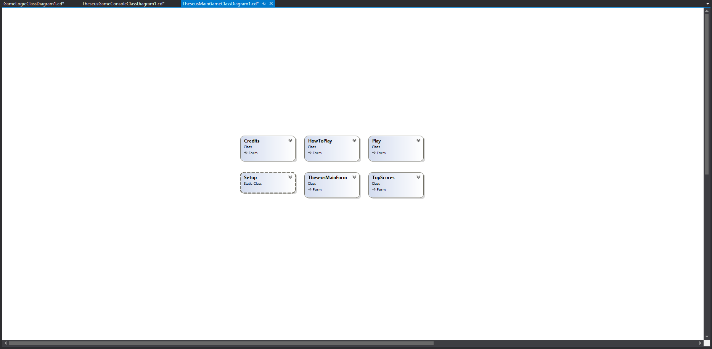
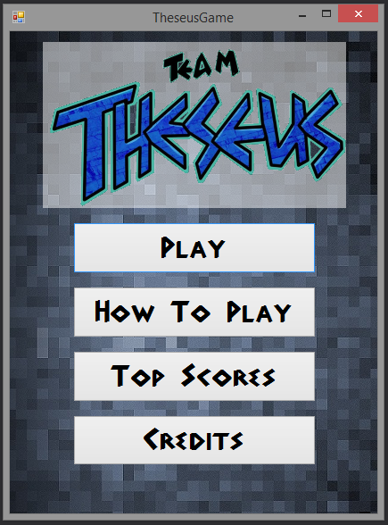

<!-- section start -->
<!-- attr: { class:'slide-title', showInPresentation:true, hasScriptWrapper:true } -->

  

	
C# OOP TeamWork

	
Telerik Academy by Progress

	<a href="https://github.com/StoikoNeykov/Teamwork-Team-Theseus" class="signature-link">Link to the GitHub repository</a>

<!-- section start -->
<!-- attr: { showInPresentation:true, style:'font-size: 0.7em' } -->

# Theseus Members

| Name | TALS | GitHub |
| :------------- | :------------------- | :------------------------------------------|
| Стойко Нейков  | StoikoNeykov | [StoikoNeykov](https://github.com/StoikoNeykov)                   |
| Станислав Божиков | bozhikovstanislav | [bozhikovstanislav](https://github.com/bozhikovstanislav)       |
| Борислав Попниколов | bpopnikolov  | [bpopnikolov ](https://github.com/bpopnikolov)         |
| ~~Никола Колчаков~~ | kolchakov96 |        ...		|
| ~~Николай Колев~~ | nastycais  |          ...       |
| ~~Мартин Табаков~~ | m.tabakov    |         ...     |

<!-- section start -->
<!-- attr: { class:'slide-title', showInPresentation:true, hasScriptWrapper:true } -->

# GitHub graphics

<!-- section start -->
<!-- attr: { class:'slide-title', showInPresentation:true, hasScriptWrapper:true } -->

# GameLogic Class Diagram

<!-- section start -->
<!-- attr: { class:'slide-title', showInPresentation:true, hasScriptWrapper:true } -->

# TheseusGameConsole Class Diagram

# TheseusMainGame Class Diagram

# Main Form Screenshot

  

# Source Code

......